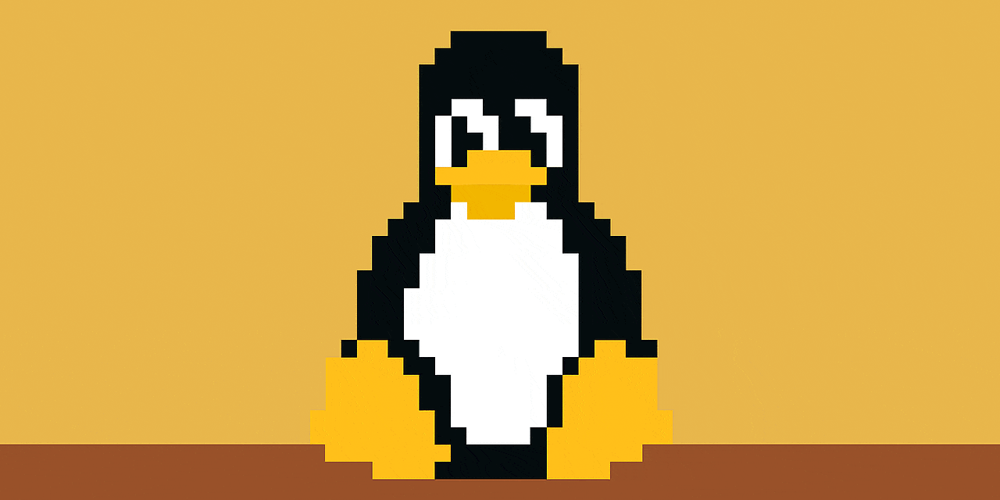

## 🛠️ About Me
- 🌱 Learning Dev//Ops Skills
- 📫 How to reach me: [Linkedin](https://www.linkedin.com/in/peerapon-phokum/)

  

## 💡 Expertise

**Languages & Frameworks:**  

  - **_Golang_**
  - Fiber

- **_Javascript/Typescript_**
  - NodeJS
  - NextJS

- **_Python_**

- **_PHP_**
  - Laravel

- **_Micro Controller_**
  - Arduino
  - NodeMCU
  

**Tools:**  

  -  Linux Distro
  -  Nginx
  -  REST  
  -  Docker 
  -  Azure
  -  Kafka

**Databases & Caching:**  

  - 🐘 PostgreSQL
  - MongoDB
  - MySQL
  - Radis

<!---
peerapon3014/peerapon3014 is a ✨ special ✨ repository because its README.md (this file) appears on your GitHub profile.
You can click the Preview link to take a look at your changes.
--->
